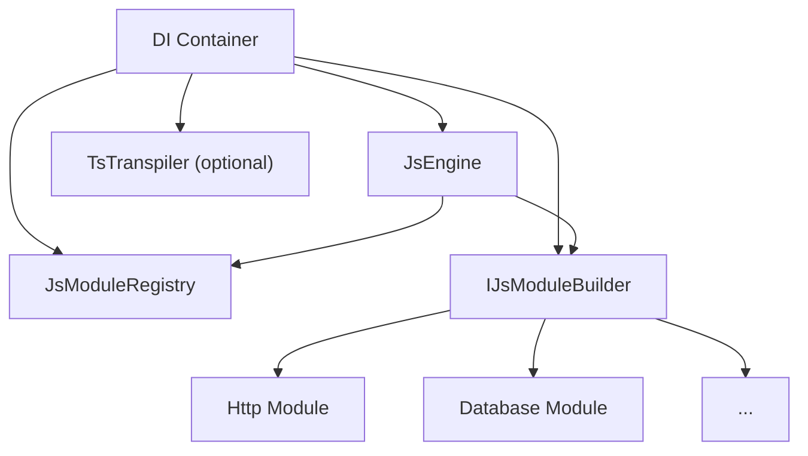
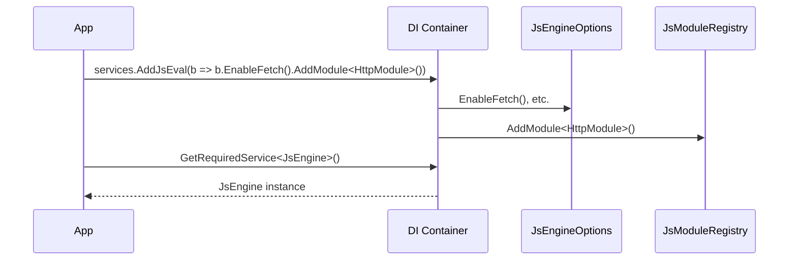

# Architecture

Cocoar.JsEval is built around three concepts: a **JsEngine** for script execution, **Modules** that extend the scripting environment, and a **Registry** that connects them through dependency injection.

## Overview



## Core Types

| Type | Purpose |
|------|---------|
| `IScriptEngine` | Interface for testability. Implemented by `JsEngine`. |
| `JsEngine` | Main engine. Executes JavaScript, manages modules, exposes values and functions. Constructor takes only typed dependencies — no `IServiceProvider`. |
| `JsEvalBuilder` | Fluent builder for configuring engine options and module registration in one call. |
| `IJsModule` | Marker interface for modules. Modules expose methods/properties to scripts. |
| `IJsModuleRegistry` | Read-only catalogue of registered module definitions. |
| `IJsModuleBuilder` | Activates module instances on demand. Owns the `IServiceProvider`-based constructor-parameter resolution — the single intentional locator boundary in the package. |
| `JsModuleAttribute` | Attribute for naming and tagging modules. |
| `JsPreparedScript` | A pre-parsed script that can be cached and reused across engine instances. |
| `TsTranspiler` | Standalone TypeScript-to-JavaScript transpiler. |

## JsEngine

`JsEngine` wraps [Jint](https://github.com/sebastienros/jint) 4.8, a .NET JavaScript interpreter (ES2025). It supports:

- Four execution methods:
  - `ExecuteAsync(string)` -- **standard**, full ES modules, import/export, async/await
  - `Evaluate(string)` / `Evaluate(JsPreparedScript)` -- lightweight sync, no module system, ideal for policy evaluation
  - `EvaluateAsync(string)` -- lightweight async, no module system but supports await
- Pre-parsed scripts via `JsEngine.Prepare()` for repeated execution
- Setting and getting values (`SetValue`, `GetValue`, `GetValueAsJson`)
- Function invocation (`GetFunction`, `InvokeFunction`)
- JSON serialization/deserialization (`JsonParse`, `JsonStringify`)
- Module loading via ES imports (in `ExecuteAsync` path)
- Engine reuse -- `Evaluate()`, `EvaluateAsync()`, and `ExecuteAsync()` can be called multiple times on the same instance

## Modules

Modules are plain .NET classes marked with `[JsModule]` that implement `IJsModule`. They receive `IScriptEngine` via constructor injection and expose public methods and properties to scripts.

In JavaScript/TypeScript, modules are available as ES module imports:

```javascript
import * as http from 'http'
import * as common from 'common'
```

## Registration Flow



## Module Instantiation

When a script calls `require('modulename')` or `import * from 'modulename'`:

1. The engine looks up the module definition in `IJsModuleRegistry`
2. `IJsModuleBuilder` activates the module — `IScriptEngine` and per-engine factory overrides (`AddModuleParameterInstance`) take precedence over the host's DI container for matching constructor-parameter types
3. The module's public API becomes available to the script
4. Module instances are cached per engine instance

::: info Why the split between registry and builder
`IJsModuleRegistry` is a passive catalogue; `IJsModuleBuilder` carries the active `IServiceProvider`. Keeping the locator pattern off `JsEngine`'s constructor lets static-analysis tools (Wolverine 6 codegen, AOT analyzers) walk `JsEngine`'s dependency tree without flagging the engine itself as a service-location dependency. See the [JsEngine guide](./engine.md#wolverine-6-strict-service-location-policy) for the Wolverine-specific allowlist note.
:::

## Package Structure

JsEval is split into focused packages:

- **Cocoar.JsEval** -- Core interfaces (`IJsModule`, `IScriptEngine`, `JsModuleAttribute`, `JsModuleRegistry`)
- **Cocoar.JsEval.Engine** -- `JsEngine`, `JsEvalBuilder`, DI registration (`AddJsEval()`)
- **Cocoar.JsEval.TypeScript** -- `TsTranspiler`, DI registration (`AddTsTranspiler()`)
- **Cocoar.JsEval.TsDefinition** -- TypeScript `.d.ts` generation for modules
- **Cocoar.JsEval.Module.*** -- 9 built-in modules

See the [Packages](/reference/packages) page for the full listing.
