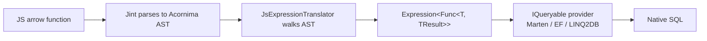

# JS → LINQ (IQueryable)

`Cocoar.JsEval.Linq` translates JavaScript arrow functions into **real .NET Expression Trees**, so any `IQueryable<T>` provider — Marten, EF Core, LINQ2DB, NHibernate, Cosmos, RavenDB, … — can convert them into native SQL or the provider's query language.

```bash
dotnet add package Cocoar.JsEval.Linq
```

::: tip Why this matters
Without this, a JS lambda passed to `.Where(...)` on an `IQueryable` falls back to `IEnumerable.Where(Func<>)` — **all rows are loaded from the database**, then filtered in memory. With this package, your JS lambda becomes an Expression Tree that the provider translates to SQL exactly as if you had written it in C#.
:::

## The Core Problem

`IQueryable<T>.Where` requires `Expression<Func<T, bool>>`:

```csharp
// C# source code:                          -> Provider sees Expression Tree
queryable.Where(u => u.Name.StartsWith("A"));
// -> WHERE name LIKE 'A%'   (SQL-side filtering, efficient)

// JS function compiled to Func<>:          -> Provider falls back to IEnumerable
queryable.Where(jsFunc);
// -> SELECT * FROM users (load everything)
//    + in-memory filter     (slow, wasteful)
```

Jint cannot build Expression Trees on its own. This package fills the gap by parsing Jint's internal AST and producing a real `Expression<Func<T, TResult>>` that is **byte-identical** to what the C# compiler would emit.

## Quick Start

### 1. Register the extension methods

```csharp
using Cocoar.JsEval.Engine;
using Cocoar.JsEval.Linq;

services.AddJsEval(b => b
    .AddLinq()          // registers JsLinqExtensions with the engine
);
```

Or without DI:

```csharp
var engine = new Jint.Engine(opts => opts
    .AllowClr(typeof(User).Assembly)
    .AddExtensionMethods(typeof(JsLinqExtensions))
);
```

### 2. Expose an `IQueryable<T>` to JS

```csharp
using (JsLinqContext.Scope(engine))
{
    engine.SetValue("users", martenSession.Query<User>());
    var result = engine.Evaluate("users.where(u => u.Name.startsWith('A') && u.IsActive)");
    // result is IQueryable<User> — already translated to SQL,
    // not yet executed. Call .ToList() on the C# side or chain more.
}
```

`JsLinqContext.Scope(engine)` sets an ambient engine reference that the extension methods use to resolve closure variables during translation. Always wrap script execution in it.

## Ordering

`orderBy`, `orderByDescending`, `thenBy`, `thenByDescending` take a **key selector** — a JS arrow returning the property (or computed value) to sort by. They chain the usual way; `.thenBy(...)` / `.thenByDescending(...)` are only available after an initial `.orderBy(...)` / `.orderByDescending(...)`.

```js
users.orderBy(u => u.Name)                   // ORDER BY name ASC
users.orderByDescending(u => u.CreatedAt)    // ORDER BY created_at DESC
users.orderBy(u => u.IsActive)
     .thenByDescending(u => u.Age)           // ORDER BY is_active ASC, age DESC
users.where(u => u.IsActive)
     .orderBy(u => u.Name)                   // WHERE ... ORDER BY name
```

The key selector's CLR return type is **inferred from the JS body** — `u.Name` gives `string`, `u.Age` gives `int`, `u.CreatedAt` gives `DateTime`, etc. `Queryable.OrderBy<T, TKey>` is invoked with that inferred `TKey`, so the provider emits the right typed ORDER BY. No explicit type annotation needed from JS.

### 3. Call the natural LINQ names from JS

```js
users.where(u => u.Name.startsWith('A') && u.IsActive)
     .where(u => u.Age > 18)          // chains, still as SQL
// -> users.ToList() on the C# side for materialization

users.count(u => u.IsActive)          // -> SELECT COUNT(*) WHERE ...
users.find(u => u.Name === 'Bob')     // -> SELECT ... LIMIT 1

users.orderBy(u => u.Name)                    // -> ORDER BY name
     .thenByDescending(u => u.Age)            // -> , age DESC
users.where(u => u.IsActive).orderBy(u => u.Name)  // chains with .where()
users.any(u => u.Age > 100)           // -> EXISTS query
```

::: info This is plain JavaScript, not TypeScript
Everything here is pure JS semantics. TypeScript is optional — it gives you IntelliSense at dev-time (via `.d.ts`), but the translator sees only JS. Scripts authored in plain `.js` work identically.
:::

## How it works



The translator recognizes:

- **Arrow functions** (root and nested, e.g. `.some(t => ...)`)
- **Property access** at any depth (`u.Address.City`)
- **Binary operators** (`===`, `==`, `!=`, `<`, `>`, `<=`, `>=`, `+`, `-`, `*`, `/`)
- **Logical operators** (`&&`, `||`), **unary** (`!`, unary minus), **ternary** (`? :`)
- **String methods** — `startsWith`, `endsWith`, `includes`, `indexOf`, `toLowerCase`, `toUpperCase`, `trim` (and their C# aliases — `Contains`, `StartsWith`, `EndsWith`, `ToLower`, `ToUpper`, `Trim`)
- **Array methods** (both styles) — JS: `some`, `every`, `find`, `filter`, `map`, `includes` — C# LINQ: `Any`, `All`, `FirstOrDefault`, `Where`, `Select`, `Contains`
- **Array methods** on collection properties — `some` → `Any`, `every` → `All`, `find` → `FirstOrDefault`, `filter` → `Where`, `map` → `Select`, `includes` → `Contains`
- **Ordering** — `orderBy` / `orderByDescending` / `thenBy` / `thenByDescending` with inferred `TKey`
- **Closures** — free identifiers are resolved via the Jint engine and embedded as `ConstantExpression`
- **Numeric coercion** — JS `number` → CLR `int`/`long`/`decimal`/... based on the target property type

## Working with a bare IQueryable

`IQueryable<T>` has no instance methods — all LINQ methods (`Where`, `Select`, `Any`, ...) are extension methods on `System.Linq.Queryable`. This package takes advantage of that:

- We register **our own** extensions with Jint.
- We **don't** register `System.Linq.Queryable`'s extensions.

Result: JS sees `users.where(...)` as our translator-powered method — and there's no fallback to the in-memory `Func<>` overload, because JS never sees `Queryable.Where` in the first place.

This means you can pass `IQueryable<T>` from any library — including 3rd-party ones where you don't control the type — directly to `engine.SetValue`. No wrapping required.

```csharp
IQueryable<Product> products = thirdPartyApi.GetProducts();
engine.SetValue("products", products);
using (JsLinqContext.Scope(engine))
    engine.Evaluate("products.where(p => p.Price > 100).any()");
```

## Parity with C# source lambdas

The emitted Expression Tree is **structurally identical** to what the C# compiler would produce for the equivalent code. This means:

- **SQL output is byte-identical** across providers.
- **Provider restrictions are the same** — if a C# `.ToString()` call breaks Marten, the equivalent JS `.toString()` breaks it the same way. No new restrictions, no hidden surprises.
- **Performance is the same** — the provider sees exactly the tree it expects.

So the contract is simple: **what works in C# works in JS. What doesn't, doesn't.**

### Provider-specific method support

Translation to SQL happens at the LINQ provider level — our translator produces a valid Expression tree, but whether a given method call is actually convertible to SQL is up to the provider. The table below is **measured** by running each method through our three provider sandboxes (see `src/Experiments/*.Sandbox/Program.cs`, scenario "Method matrix"):

| Method (JS or C# alias) | Marten (PG/JSONB) | EF Core (SQLite) | LINQ2DB (SQLite) |
|---|:---:|:---:|:---:|
| `startsWith` / `StartsWith` | ✅ | ✅ | ✅ |
| `endsWith` / `EndsWith` | ✅ | ✅ | ✅ |
| `includes` / `Contains` (string) | ✅ | ✅ | ✅ |
| `toLowerCase` / `ToLower` | ✅ | ✅ | ✅ |
| `toUpperCase` / `ToUpper` | ✅ | ✅ | ✅ |
| **`indexOf` / `IndexOf`** | **❌** `BadLinqExpressionException` | ✅ | ✅ |
| **`(int).toString` / `ToString`** | **❌** `BadLinqExpressionException` | ✅ | ✅ |
| `some` / `Any` (on collection property) | ✅ (JSONB `@>`) | — | — |
| `includes` / `Contains` (on collection property) | ✅ (JSONB `@>`) | — | — |

Notes:

- EF Core and LINQ2DB were tested against SQLite — results may vary for SQL Server / Postgres / Oracle where a provider can emit a native equivalent (e.g. `POSITION`, `CHARINDEX`). Always sanity-check with your actual database.
- Marten's `IndexOf` / `ToString` rejection is a known limitation of Marten's LINQ translator (tracked upstream). If you need "substring contained", use `includes` / `Contains` — it maps to `LIKE '%…%'` which Marten supports.
- Our translator deliberately does **not** pre-validate — it produces the Expression tree you wrote, the provider decides if it can emit SQL for it. This is the **same** behaviour you'd get from a hand-written C# source lambda.

**Rule of thumb:** for portability across providers, stick to `startsWith` / `endsWith` / `includes` / `ToLower` / `ToUpper`. The stricter providers (like Marten) set the common denominator.

## Property Dependency Tracking

Once you have an Expression Tree, you can ask it: *"which properties does this query touch?"* — essential for triggers, cache invalidation, and reactive re-evaluation.

```csharp
using Cocoar.JsEval.Linq.Dependencies;

var jsFn = engine.Evaluate(@"
    (u) => u.Name.startsWith('A')
        && u.IsActive
        && u.Address.City === 'Vienna'
        && u.Tags.some(t => t === 'vip')
");
var expr = JsExpressionTranslator.Translate<User, bool>(jsFn, engine);

var deps = ExpressionDependencyCollector.Collect(expr);
```

### The `PropertyDependencies` result

```csharp
deps.Paths       // IReadOnlySet<string> — every dotted path accessed
                 // { "Name", "IsActive", "Address", "Address.City", "Tags" }

deps.TopLevel    // IReadOnlySet<string> — only the root segments
                 // { "Name", "IsActive", "Address", "Tags" }

deps.Unsafe      // bool — true if something could not be analyzed statically
```

Both `Paths` and `TopLevel` are plain sets — iterate, `.ToList()`, serialize to JSON, whatever you need:

```csharp
foreach (var path in deps.Paths)
    Console.WriteLine(path);

var list = deps.Paths.ToList();
var json = JsonSerializer.Serialize(deps.Paths);

// Common check: does the query reference a specific top-level property?
if (deps.TopLevel.Contains("Email")) { ... }
```

### `DependsOn` — ancestor-aware lookup

For the reactive use case — *"did this change affect the query?"* — use `DependsOn`. It's smarter than a plain set lookup because it walks up the ancestor chain:

```csharp
deps.DependsOn("Name")         // true  — exact match
deps.DependsOn("Email")        // false — not referenced
deps.DependsOn("Address.City") // true  — exact match
deps.DependsOn("Address.Zip")  // true  — because "Address" is in the set
                               //         (parent-object change could affect City)
```

So there are really two different lookups:

| Question | Use |
|---|---|
| *What properties were accessed?* (logging, debugging, persisting) | `deps.Paths` / `deps.TopLevel` directly |
| *Does this changed property affect the query?* (trigger logic) | `deps.DependsOn(changedPath)` |

### Use case: selective re-execution

A script defines a dynamic "group" of users via a predicate. When a user document is updated, you want to re-run the script **only** if a property relevant to the predicate changed:

```csharp
var deps = ExpressionDependencyCollector.Collect(expr);

userDocumentStore.OnUpdated += (user, changedProperties) =>
{
    var needsRerun = changedProperties.Any(deps.DependsOn);
    if (needsRerun)
        RerunGroupMembership(user);
    // else: group membership cannot have changed — skip
};
```

### Unsafe fallback

If the expression contains dynamic indexing (`u[prop]`) or patterns the collector cannot safely analyze, `deps.Unsafe == true`. In that case, `DependsOn(...)` always returns `true` — callers should treat this as *invalidate-all*. `deps.Paths` still returns whatever the collector did manage to extract.

## C# LINQ aliases (IntelliSense both ways)

The translator accepts **both** JS-native method names (`includes`, `some`, `toLowerCase`, …) and their C# LINQ counterparts (`Contains`, `Any`, `ToLower`, …) — both produce byte-identical Expression trees. Pick whichever style you're more comfortable with.

| JS-native | C# LINQ alias | Emitted CLR method |
|---|---|---|
| `str.includes(x)` | `str.Contains(x)` | `string.Contains` |
| `str.startsWith(x)` | `str.StartsWith(x)` | `string.StartsWith` |
| `str.endsWith(x)` | `str.EndsWith(x)` | `string.EndsWith` |
| `str.indexOf(x)` | `str.IndexOf(x)` | `string.IndexOf` |
| `str.toLowerCase()` | `str.ToLower()` | `string.ToLower` |
| `str.toUpperCase()` | `str.ToUpper()` | `string.ToUpper` |
| `str.trim()` | `str.Trim()` | `string.Trim` |
| `arr.some(p)` | `arr.Any(p)` | `Enumerable.Any` |
| `arr.every(p)` | `arr.All(p)` | `Enumerable.All` |
| `arr.filter(p)` | `arr.Where(p)` | `Enumerable.Where` |
| `arr.map(f)` | `arr.Select(f)` | `Enumerable.Select` |
| `arr.find(p)` | `arr.FirstOrDefault(p)` | `Enumerable.FirstOrDefault` |
| `arr.includes(v)` | `arr.Contains(v)` | `Enumerable.Contains` |

### TypeScript IntelliSense for both

TypeScript's built-in `lib.es5.d.ts` only knows the JS-native names. To make the C# LINQ aliases discoverable in Monaco / VS Code while authoring scripts, drop a single `.d.ts` file into the script workspace — TypeScript's **declaration merging** adds the aliases to the built-in `String` / `Array<T>` interfaces without breaking anything:

```ts
interface String {
    Contains(value: string): boolean;
    StartsWith(value: string): boolean;
    ToLower(): string;
    // ...
}

interface Array<T> {
    Any(predicate?: (item: T) => boolean): boolean;
    Where(predicate: (item: T) => boolean): T[];
    Select<R>(selector: (item: T) => R): R[];
    // ...
}
```

The full file ships **as an embedded resource** in the `Cocoar.JsEval.Linq` NuGet package. Extract it at startup:

```csharp
// Write the type-definitions file next to your scripts directory:
LinqTypeScriptDefinition.WriteTo("scripts/cocoar-jseval-linq.d.ts");

// Or read the string directly and serve it to a browser-side Monaco editor:
var dts = LinqTypeScriptDefinition.Read();
```

Reference it from a script with either a `/// <reference path="./cocoar-jseval-linq.d.ts" />` directive or a `tsconfig.json` `include`.

## Typed values from JS: `linq.*` helpers

JavaScript has only one numeric type — `number`, an IEEE-754 double. Literal precision is lost before .NET ever sees it (`0.1 + 0.2 === 0.30000000000000004`). To write precision-critical literals **inline** in a query predicate, use the `linq.*` helpers:

```js
// Numeric
users.where(u => u.Price      > linq.decimal('99.99'))
users.where(u => u.Pi         > linq.double('3.14159265358979'))
users.where(u => u.Count      === linq.int('42'))
users.where(u => u.ExternalId === linq.long('9007199254740993'))   // > 2^53, not safe in JS number

// Date / time
users.where(u => u.CreatedAt  > linq.date('2024-01-01'))           // DateTime, Unspecified
users.where(u => u.LastSeen   > linq.dateUtc('2024-01-01T00:00:00Z')) // DateTime, Kind=Utc
users.where(u => u.LastLogin  > linq.dateOffset('2024-01-01T10:00:00+02:00'))
users.where(u => u.Birthday  === linq.dateOnly('1990-06-15'))      // DateOnly (.NET 6+)
users.where(u => u.OpenAt    === linq.timeOnly('09:00:00'))        // TimeOnly (.NET 6+)
users.where(u => u.Timeout   >  linq.timeSpan('01:30:00'))         // TimeSpan

// Identity
users.where(u => u.Id === linq.guid('00000000-0000-0000-0000-000000000001'))

// Current date/time (captured at translation time)
todos.where(t => t.DueDate < linq.today().AddDays(7))   // "due this week"
audits.where(a => a.CreatedAt > linq.utcNow().AddHours(-24))
events.where(e => e.At > linq.now())
```

The translator recognizes these patterns **at the AST level** and emits a typed `Expression.Constant` directly — bypassing Jint's runtime, which would otherwise marshal `decimal`/`long` back to JS `number` and lose precision.

### Registration

`.AddLinq()` automatically registers the runtime `linq` global. No extra configuration needed:

```csharp
services.AddJsEval(b => b.AddLinq());
```

For engines built without the JsEval builder, call `LinqCasts.Register(engine)` manually — e.g. after `opts.AddExtensionMethods(typeof(JsLinqExtensions))`:

```csharp
var engine = new Jint.Engine(opts =>
{
    opts.AllowClr(typeof(User).Assembly);
    opts.AddExtensionMethods(typeof(JsLinqExtensions));
});
Cocoar.JsEval.Linq.LinqCasts.Register(engine);
```

### Rules

- **String literal argument required.** `linq.decimal('99.99')` works; `linq.decimal(myVar)` throws at translation time.
- **Invariant culture.** Always `.`, never `,`. `linq.decimal('99,99')` is rejected.
- **Translator-time precision** — only inline in predicates gets the exact `decimal`/`long`. At plain JS runtime (outside a query), Jint converts return values to JS `number`, so `const x = linq.decimal('99.99')` gives you a double.

### When not to use

- **Host-set values** — if the value comes from C#, just set it directly: `engine.SetValue("threshold", 99.99m)`. Closures preserve `decimal`/`long` precisely without needing `linq.*`.
- **Runtime-computed values in JS** — you can't (JS has no decimal). Do the computation in C# and pass in.

## Customizing Method Translation

The default method map handles the common JS string/array methods. To support custom JS-callable methods that should translate to specific .NET methods, implement `IJsMethodMap`:

```csharp
using System.Linq.Expressions;
using Cocoar.JsEval.Linq.MethodMapping;

public sealed class MyMethodMap : IJsMethodMap
{
    public bool TryResolve(MethodResolveRequest req, out Expression? result)
    {
        // JS: someString.normalizedEquals(other)
        // -> string.Equals(someString, other, StringComparison.OrdinalIgnoreCase)
        if (req.Target.Type == typeof(string) && req.JsMethodName == "normalizedEquals")
        {
            var mi = typeof(string).GetMethod(
                nameof(string.Equals),
                [typeof(string), typeof(string), typeof(StringComparison)])!;
            result = Expression.Call(mi, req.Target, req.Arguments[0],
                Expression.Constant(StringComparison.OrdinalIgnoreCase));
            return true;
        }
        result = null;
        return false;
    }
}
```

Stack maps with `CompositeJsMethodMap(custom, default)`:

```csharp
var options = new TranslationOptions
{
    MethodMap = new CompositeJsMethodMap(new MyMethodMap(), new DefaultJsMethodMap())
};

using (JsLinqContext.Scope(engine, options))
{
    // Now JS can call users.where(u => u.Name.normalizedEquals('alice'))
}
```

## Wrapper alternative

Extension methods are the recommended default. If you need stricter control — e.g., a JS sandbox that shouldn't see the raw `IQueryable` type — build a thin wrapper:

```csharp
public sealed class JsUsers
{
    private readonly IQueryable<User> _queryable;

    public JsUsers(IQueryable<User> q) => _queryable = q;

    public JsUsers Where(JsValue predicate) =>
        new(_queryable.Where(JsExpressionTranslator.Translate<User, bool>(
            predicate, JsLinqContext.CurrentEngine)));

    public List<User> ToList() => _queryable.ToList();
}

// JS sees only Where / ToList — nothing else on IQueryable.
engine.SetValue("users", new JsUsers(session.Query<User>()));
```

Use when:

- You want a tightly controlled JS surface per domain type.
- The method names or semantics should differ from plain LINQ (e.g. `onlyActive()`).
- Extension-method registration is not available (e.g., a sandboxed engine).

## Supported LINQ Providers

Verified against three independent sandboxes, each proving **byte-identical SQL** between JS-translated queries and hand-written C# source lambdas:

| Provider | Backend | Sandbox |
|---|---|---|
| **Marten** | PostgreSQL (JSONB — including `@>` containment for `.some()` / `.any()`) | [`src/Experiments/JsEval.Marten.Sandbox`](https://github.com/cocoar-dev/Cocoar.JsEval/tree/develop/src/Experiments/JsEval.Marten.Sandbox) |
| **Entity Framework Core** | SQLite (in-memory) — standard LINQ-to-SQL translation | [`src/Experiments/JsEval.EfCore.Sandbox`](https://github.com/cocoar-dev/Cocoar.JsEval/tree/develop/src/Experiments/JsEval.EfCore.Sandbox) |
| **LINQ2DB** | SQLite (in-memory) — alternative LINQ provider with distinct internals | [`src/Experiments/JsEval.Linq2Db.Sandbox`](https://github.com/cocoar-dev/Cocoar.JsEval/tree/develop/src/Experiments/JsEval.Linq2Db.Sandbox) |

Each sandbox runs two scenarios: SQL parity against a C# baseline, and property dependency tracking.

Compatible **by construction** with any other provider that consumes `Expression<Func<T, bool>>`:

- **NHibernate** — `IQueryable` LINQ provider
- **MongoDB C# Driver** — `IMongoQueryable<T>`
- **RavenDB**, **Cosmos DB**, **LINQ to SQL**, **LLBLGen Pro**, ...
- **Plain `IEnumerable<T>.AsQueryable()`** — falls back to compiled delegates for in-memory filtering

Unsupported provider features (e.g., Marten does not translate `int.ToString()`) throw the same provider-specific exception you'd get from hand-written C# — the translator imposes no additional restrictions.

::: tip Provider-specific gotchas
- **EF Core:** Expose `db.Users.AsNoTracking()` (or another `IQueryable<T>`) rather than the bare `DbSet<T>` — Jint otherwise resolves calls against `DbSet<T>.Find(object[] keys)` (the EF-internal lookup) instead of our extension method.
- **Marten:** Raw `session.Query<T>()` works directly. No wrapping needed.
- **LINQ2DB:** Use `db.GetTable<T>().AsQueryable()` for a clean `IQueryable<T>` handle.
:::

## Current Limitations

### Single-parameter lambdas only

```ts
u => u.Name === 'x'              // ✓ supported
(u, idx) => u.Tags[idx] === 'x'  // ✗ throws with helpful message
```

This matches `Queryable<T>` itself — `Where`, `Any`, `First` etc. accept only unary predicates. Multi-arg variants like `Where((item, idx) => ...)` exist **only on `IEnumerable<T>`** for in-memory iteration; no SQL provider supports them. For extra state, capture values via closures.

### No destructuring / rest in parameter lists

```ts
u => u.Name === 'x'              // ✓ supported
({ Name }) => Name === 'x'       // ✗ throws — use u.Name directly
(...args) => args[0].Name        // ✗ throws — use u.Name directly
```

Technically translatable but not meaningful in LINQ predicates. The thrown `NotSupportedException` points you to the direct-property-access alternative.

### Member access: static only

```ts
u.Name                           // ✓ supported (identifier)
u['Name']                        // ✓ supported (string literal in brackets)
u['Address']['City']             // ✓ supported (chained string literals)
u[fieldName]                     // ✗ throws — variable access can't be translated
u[0]                             // ✗ throws — computed numeric index
```

The property needs to be resolvable at translation time for the Expression tree to be built. Static strings (whether dotted or bracketed) work identically; dynamic lookups cannot, because LINQ providers need a `PropertyInfo` handle before query execution — not during it.

### Numeric precision

- **Arithmetic in predicates** — `u.Price * 1.1 > 10` works; the translator coerces the double literal to `decimal` before the multiply
- **Literal precision** — `u.Price > 99.99` works for "normal" values; for precision-critical literals use [`linq.decimal('99.99')`](#typed-values-from-js-linq-helpers)
- **Host-set closures** — `engine.SetValue("threshold", 99.99m)` keeps `decimal` all the way through to the Expression tree; no coercion loss
- **Exact equality with doubles** — avoid. `0.1 + 0.2 !== 0.3` in JS, so queries like `u.Balance === 100.00` may miss rows if the JS-side produced the constant via arithmetic. Use `linq.decimal('100.00')` or closures instead

### Date / Time

- **Host-set closures** — `engine.SetValue("cutoff", DateTime.UtcNow)` preserves `DateTime` with its `Kind` all the way through
- **Inline literals** — use [`linq.date('...')`](#typed-values-from-js-linq-helpers) and its variants (`dateUtc`, `dateOffset`, `dateOnly`, `timeOnly`) for precise typed constants; the translator intercepts these at AST level
- **Avoid `new Date(...)` in predicates** — not supported by the translator. Use `linq.date(...)` instead
- **Runtime `linq.date(...)` outside a predicate** — Jint marshals `DateTime` through its JS `Date` bridge with local-timezone normalization; use inline-in-predicate or host-set closures where precision matters
- **`CsDateTime` for fluent date arithmetic in JS** — see [CsDateTime wrapper](#csdatetime-date-arithmetic-in-js)

### CsDateTime: date arithmetic in JS

Because Jint marshals `DateTime` to a JS `Date` (losing `.AddDays`, `.AddMonths`, etc.), we ship a thin `CsDateTime` wrapper that exposes the full .NET `DateTime` API to JS. The translator applies user-defined implicit operators automatically, so comparisons against `DateTime` columns Just Work.

**Enable via the builder:**

```csharp
services.AddJsEval(b => b
    .AddLinq()
    .EnableCsDateTime());
```

**Use in JS:**

```js
// Factory statics — mirror .NET:
CsDateTime.Now
CsDateTime.UtcNow
CsDateTime.Today
CsDateTime.Parse('2024-01-01')
CsDateTime.From(2024, 6, 15)
CsDateTime.From(2024, 6, 15, 14, 30, 0)

// Fluent API (PascalCase; Jint is case-insensitive, so lowercase works too):
const next = CsDateTime.UtcNow.AddDays(7).AddHours(3)
next.Year    next.Month   next.Day
next.Hour    next.Minute  next.Second
next.ToIsoString()
next.IsBefore(other)
next.IsAfter(other)

// In queries — implicit operator CsDateTime -> DateTime kicks in:
users.where(u => u.CreatedAt > CsDateTime.UtcNow.AddDays(-7))

// Or pass a closure from C#:
// engine.SetValue("cutoff", new CsDateTime(DateTime.UtcNow));
users.where(u => u.CreatedAt > cutoff.AddDays(-7))
```

**Why this works in LINQ predicates:**

`CsDateTime` has `public static implicit operator DateTime(CsDateTime v)`. The translator uses `Cocoar.Reflectensions` to find this operator whenever a binary expression has mismatched types, and inserts a `Convert` node — so the Expression tree ends up as `u.CreatedAt > Convert(cutoff.AddDays(-7), DateTime)`. Marten / EF Core / LINQ2DB evaluate the constant-side subtree at translation time and emit plain SQL.

### Null-safety: `?.` and `??` (v3.1+)

Both optional chaining and nullish coalescing translate to Expression trees:

```js
// Optional chaining — each `?.` short-circuits the rest of the chain to null
users.where(u => u.Address?.City === 'Vienna')
users.where(u => u.Address?.City.startsWith('V') === true)

// Nullish coalescing — fallback value when left side is null
users.where(u => (u.Name ?? 'anon').startsWith('A'))

// Combined — the common "safe nested access with default" shape
users.where(u => (u.Address?.City ?? '') === 'Vienna')
```

**Shape the translator emits:**

- `u.Address?.City` → `u.Address == null ? null : u.Address.City` (result type is `string` nullable)
- Nested chains like `a?.b?.c` wrap outermost-first: `a == null ? null : (a.b == null ? null : a.b.c)`
- A guard on a non-nullable value-type target is skipped (the target can never be null; e.g. `u.Id?.ToString()` where `Id` is a `Guid`)
- `??` maps to `Expression.Coalesce` — CLR requires the left side to be a reference type or `Nullable<T>`

**Works for both SQL translation and in-memory `Expression.Compile()`.** That makes `?.` particularly useful when you're also running the same predicate outside the LINQ provider (e.g. evaluating group membership against a single in-memory user object) — no `NullReferenceException` from un-guarded navigation.

### Enum

JS has no native enum type, so predicates use strings or numbers:

```js
users.where(u => u.Status === 'Active')    // by name (case-insensitive)
users.where(u => u.Status === 1)           // by numeric ordinal
users.where(u => u.Status !== 'Archived')  // inequality works too
```

The translator **auto-coerces** the literal side into a typed enum `Expression.Constant` when the other side is an enum property. Output is the ORM-neutral native form (`u.Status == UserStatus.Active` — **without** the C# compiler's implicit `Convert(enum, Int32)` wrapper), so providers storing enums as strings (Marten with `EnumStorage.AsString`, EF Core with `HasConversion<string>()`) translate correctly without a rewrite pass.

String-to-enum matching is case-insensitive (`'Active'` = `'active'` = `'ACTIVE'`). Invalid names throw with a clear message listing the valid values.

## Polymorphic Types — Discriminator Mapping

When a `IQueryable<T>` covers multiple entity kinds, scripts use `Type.Is(a, 'dog')` and `Type.IsOneOf(a, ['dog','cat'])` to filter by type. The translator intercepts these calls and generates the appropriate LINQ expression for the active discrimination strategy.

### Setup

#### With JsEval builder (DI / full engine)

```csharp
// With Monaco IntelliSense narrowing — view types for Monaco only, not stored in the DB
public class PersonView  : Participant { }
public class CompanyView : Participant { }

services.AddJsEval(b => b
    .AddLinq()
    .AddDiscriminatorMappings<Participant>("ParticipantType",
        ("person",  typeof(PersonView)),
        ("company", typeof(CompanyView))));

// Without Monaco narrowing — Type.Is returns a plain boolean
services.AddJsEval(b => b
    .AddLinq()
    .AddDiscriminatorMappings<Participant>("ParticipantType", "person", "company"));
```

`AddDiscriminatorMappings` registers a `Type` JS global so `Type.Is` and `Type.IsOneOf` work in **all** scripts — not just LINQ predicates.

Pass the mappings to `TranslationOptions` for LINQ translation:

```csharp
var options = new TranslationOptions
{
    DiscriminatorMappings = engine.Options.DiscriminatorMappings
};

using (JsLinqContext.Scope(engine, options))
    session.Query<Participant>().Where(p => Type.Is(p, 'person') && p.Firstname.startsWith('A'));
```

#### Without the builder (translator-only)

```csharp
// DiscriminatorMapping is in Cocoar.JsEval.Engine
var options = new TranslationOptions
{
    DiscriminatorMappings =
    [
        new(typeof(Participant), "person",  typeof(PersonView),  "ParticipantType"),
        new(typeof(Participant), "company", typeof(CompanyView), "ParticipantType"),
    ]
};

var expr = JsExpressionTranslator.Translate<Participant, bool>(jsFn, engine, options);
```

### `Type.Is()` — single type check

```typescript
(p) => Type.Is(p, 'person')
// → p.ParticipantType == "person"
// Marten SQL: WHERE data->>'ParticipantType' = 'person'
```

### `Type.IsOneOf()` — multiple types

`Type.IsOneOf(a, ['v1','v2'])` is shorthand for `Type.Is(a,'v1') || Type.Is(a,'v2')`. The translator expands it to an `OrElse` chain:

```typescript
(p) => Type.IsOneOf(p, ['person', 'company'])
// → p.ParticipantType == "person" || p.ParticipantType == "company"
// Marten SQL: WHERE data->>'ParticipantType' = 'person' OR data->>'ParticipantType' = 'company'
```

### AND conditions

**Property-only discriminator** (no `ConcreteType`) — base-type properties only, no cast:

```typescript
(p) => Type.Is(p, 'person') && p.Firstname.startsWith('A')
// → p.ParticipantType == "person" && p.Firstname.StartsWith("A")
// Marten SQL: WHERE data->>'ParticipantType' = 'person' AND data->>'Firstname' LIKE 'A%'

(p) => Type.IsOneOf(p, ['person', 'company']) && p.Name.startsWith('A')
// → (p.ParticipantType == "person" || p.ParticipantType == "company") && p.Name.StartsWith("A")
```

**Combined discriminator** (`ConcreteType` set alongside `PropertyName`) — base-type properties need no cast; subtype-only properties are resolved and cast automatically. The ORM still receives the property-equality filter (`p.Prop == "value"`); the narrowing is a translator-side side-channel:

```typescript
// Email is on PersonView only — translator recognizes the property-equality
// check, injects PersonView as the narrowing target, and emits the cast.
(p) => Type.Is(p, 'person') && p.Email.endsWith('@example.com')
// → p.ParticipantType == "person" && ((PersonView)p).Email.EndsWith("@example.com")

// Optional chaining works too (v3.3.0+):
(p) => Type.Is(p, 'person') && p.Email?.endsWith('@example.com')
// → p.ParticipantType == "person" && ((PersonView)p).Email != null && ((PersonView)p).Email.EndsWith("@example.com")
```

### IntelliSense in Monaco

Register the same mappings on the `DefinitionBuilder` to generate a `declare const Type` with TypeScript type-predicate overloads. See [Discriminator overloads in TsDefinition](./ts-definitions#discriminator-overloads) for the full setup.
